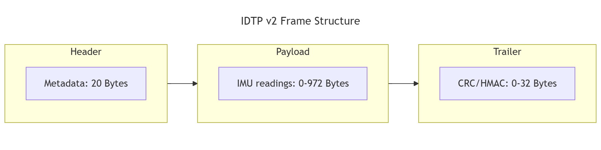
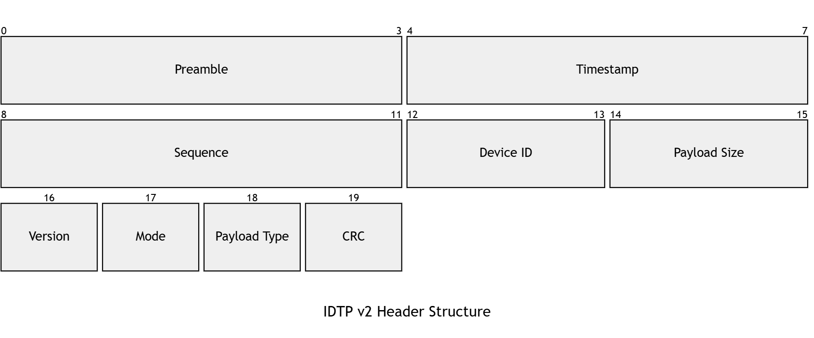

# IDTP - Inertial Measurement Unit (IMU) Data Transfer Protocol

**Inertial Measurement Unit Data Transfer Protocol (IDTP)** - lightweight protocol designed for high-performance and reliable IMU data transmission between microcontrollers and host systems.

It is tailored for **autonomous navigation**, **wearable devices** and **robotics** where low latency, and data integrity are paramount.

[See what's new in IDTP v2.0](CHANGELOG.md)

## 🎯 Why IDTP?

IDTP solves the problem of **unifying data exchange** between different types of **Inertial Measurement Units (IMU)** and host systems, providing a multi-level data integrity checking.

## ⚙️ Core features

- **Zero-Copy Ready**: Ensures aligned memory access: prevents "unaligned access" penalties and CPU exceptions when casting payloads directly to `float` or `double` structures.
- **Time-Critical Accuracy**: Built-in `timestamp` fields ensure that sensor fusion and trajectory estimation algorithms receive precise measurement times without transmission latency issues.
- **Hardware Optimized**: Using **CRC-8/32-AUTOSAR** algorithms, supported by hardware accelerators on modern MCUs.
- **Scalable Protection**:
  - `IDTP-L (Lite)`: 0% frame trailer overhead, only **CRC-8** for header.
  - `IDTP-S (Safety)`: **CRC-32** for the whole frame protection.
  - `IDTP-SEC (Secure)`: **HMAC-SHA256** for data spoofing protection.

---

## 📄 Documentation

For complete technical implementation of protocol
read [technical specification v2.0.0](docs/SPECIFICATION.md).

## 📦 Implementations

*   **[C Implementation](src/c)**:
      * Header-only library. Easy to integrate into any MCU vendor HAL.
      * Portable (only `stdint.h` & `string.h` headers are used).
      * Zero-allocation library.
*   **[Rust Implementation](src/rust)**:
    *   Fully `no_std` compatible. Designed specifically for memory-safe embedded environments.
    *   Zero-allocation crate.
    *   Few external dependencies.

## 📜 License

Copyright (C) 2025-present idtp project and contributors.

Licensed under the Apache License, Version 2.0 (the "License");
you may not use this file except in compliance with the License.
You may obtain a copy of the License at

http://www.apache.org/licenses/LICENSE-2.0

Unless required by applicable law or agreed to in writing, software
distributed under the License is distributed on an "AS IS" BASIS,
WITHOUT WARRANTIES OR CONDITIONS OF ANY KIND, either express or implied.
See the License for the specific language governing permissions and
limitations under the License.
